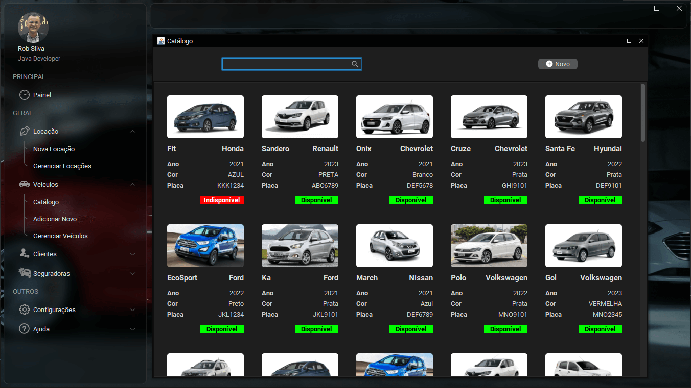

# Locadora de Veículos em Java Swing

Este é um projeto de uma locadora de veículos desenvolvido em Java Swing. Ele utiliza várias bibliotecas e recursos para proporcionar uma experiência moderna e funcional aos usuários.

## Bibliotecas Utilizadas

- [FlatLaf](https://github.com/JFormDesigner/FlatLaf): Biblioteca para criação de interfaces gráficas com visual moderno e flat.
- [MigLayout](https://github.com/mikaelgrev/miglayout): Layout manager que facilita a criação de interfaces gráficas flexíveis.
- [RobRepository](https://github.com/imrob-s/robrepository-lib): Biblioteca desenvolvida para facilitar a persistência de dados em banco de dados.
- [OpenFeign](https://github.com/OpenFeign/feign): Biblioteca para realizar requests em APIs externas de forma simples e elegante.
- [EhCache](https://github.com/ehcache/ehcache3): Biblioteca para criar cache de dados em memória.
- [Dotenv](https://github.com/cdimascio/java-dotenv): Utilizada para gerenciar variáveis de ambiente, como informações sensíveis do banco de dados.
- [Bibliotecas do Ra Ven](https://github.com/DJ-Raven/): Diversas bibliotecas úteis para o desenvolvimento em Java Swing.

## Banco de Dados

Este projeto utiliza o PostgreSQL como banco de dados para armazenar as informações da locadora.

## Integração com APIs Externas

Foram realizadas integrações com a [BrasilAPI](https://github.com/BrasilAPI/BrasilAPI) para buscar informações de empresas através do CNPJ e para retornar dados de logradouro através do CEP.

## MapperTableModel

Foi criada uma classe genérica chamada MapperTableModel para facilitar a criação de tabelas no Java Swing, tornando o processo mais eficiente e organizado.

## Demonstração

Confira uma demonstração do funcionamento da aplicação no YouTube:

## Como Contribuir

Se você deseja contribuir com este projeto, fique à vontade para abrir uma issue ou enviar um pull request. Toda contribuição é bem-vinda!
